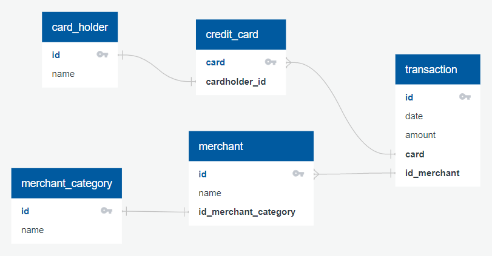
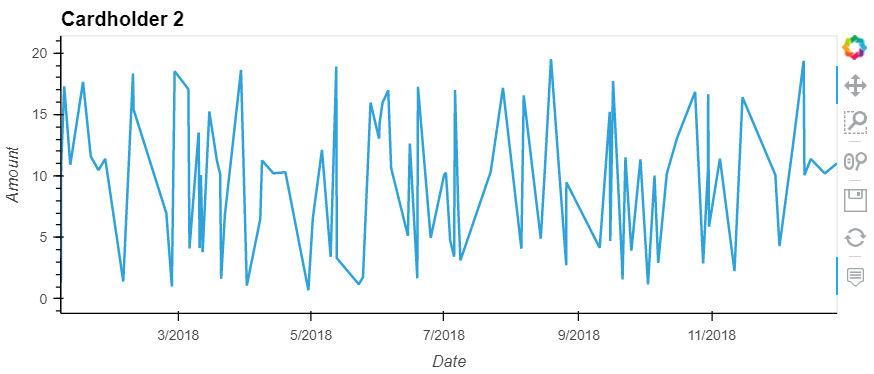
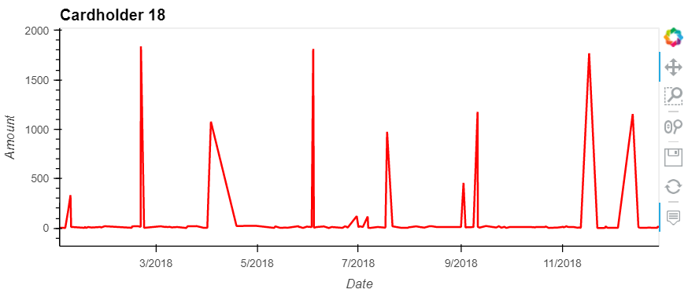
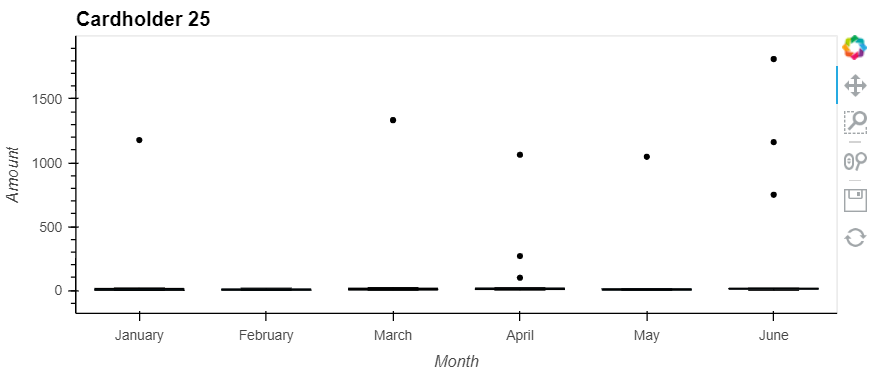

# Markdown Report

## ERD

Based on the data provided, we can construct a database with the following schema that results in the subsequent diagram:

```
card_holder
-
id PK
name

credit_card
-
card PK
cardholder_id FK - card_holder.id

merchant
-
id PK
name
id_merchant_category FK - merchant_category.id

merchant_category
-
id PK
name

transaction
-
id PK
date
amount
card FK -< credit_card.card
id_merchant FK -< merchant.id
```



## Question 1
```
The two most important customers of the firm may have been hacked. Verify if there are any fraudulent transactions in their history. For privacy reasons, you only know that their cardholder IDs are 2 and 18.
```

After querying the database for the transactions of cardholders 2 & 18,
we can seperate the activity of each individual and create the following line charts:



If we combine the two, the resulting plot is as follows:


From this, we can see that The biggest differences between the two cardholders are the frequency and size of their transactions. While Cardholder 2's consumption is very volitile, all purchases are under $20. Conversely, Cardholder 18's transactsions are less frequent but far larger than the avove. 

This difference does suggest fraud as the latter is so anomalous compared to normal spending habits. It is, therefore, more likely that cardholder 18 was hacked.

## Data Analysis Question 2
```
The CEO of the biggest customer of the firm suspects that someone has used her corporate credit card without authorization in the first quarter of 2018 to pay quite expensive restaurant bills. Again, for privacy reasons, you know only that the cardholder ID in question is 25.
```

After querying the database for the transactions of cardholders 25, we can create the following box plot for the first 6 months of 2018:


This chart shows several outliers for Cardholder 25. When broken down by month They are as follows:
- January: 1
- Febuary: 0
- March: 1
- April: 3
- May: 1
- June: 3

From this we can see that the majority of anomolous transactions occured in the second quarter of 2018 rather than the first. While this pattern does suggest fraud, the CEO is technically wrong about the timeframe. It is far more likely that a hack occured between April and June. 
  

